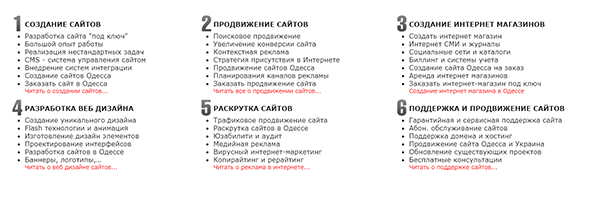
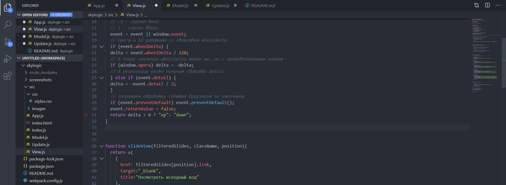

live версия: http://rudomanenkovladimir.com/remakes/skylogic/

### 1.Изменил поведение пунктов меню при наведении
Было | Стало
------------ | -------------
 | 

### 2.Изменил отображение информации, ссылаясь на UX принцип "прогрессивное раскрытие"
Было | Стало
------------ | -------------
 | 

### 3. Написал слайдер на JS, используя функциональный программирование JS

