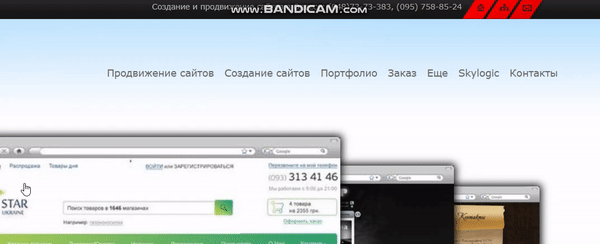

### 1.Изменил поведение пунктов меню при наведении
Было | Стало
------------ | -------------
 | 

### 2.Изменил отображение информации, ссылаясь на UX принцип "прогрессивное раскрытие"
Было | Стало
------------ | -------------
 | 

